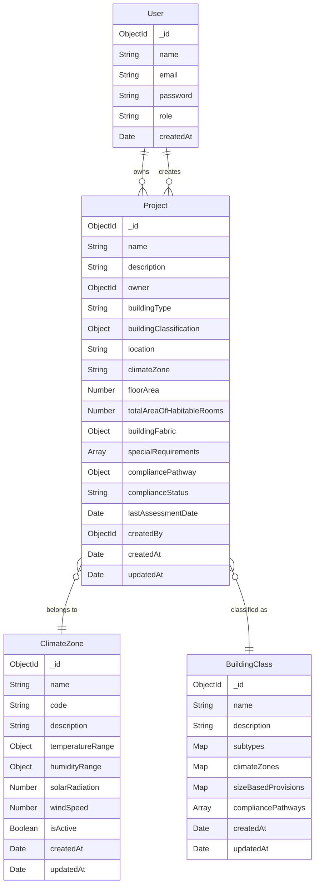

# NCC Section J Compliance Checker - Database Structure

## Entity Relationship Diagram (UML)



## Entity Descriptions

### User
- Primary entity for user management
- Stores user authentication and authorization information
- Has a one-to-many relationship with Projects (as owner and creator)

### Project
- Core entity for building compliance assessment
- Contains building specifications and compliance information
- References User (owner and creator), ClimateZone, and BuildingClass
- Stores building fabric details and special requirements
- Tracks compliance status and assessment history

### BuildingClass
- Defines building classifications and their requirements
- Contains subtype-specific requirements and provisions
- Maps climate zone-specific requirements
- Includes size-based provisions and compliance pathways

### ClimateZone
- Defines climate zones and their characteristics
- Stores temperature, humidity, and environmental data
- Used for determining building compliance requirements

## Relationships

1. User to Project:
   - One-to-many relationship
   - A user can own multiple projects
   - A user can create multiple projects

2. Project to ClimateZone:
   - Many-to-one relationship
   - Projects must belong to a specific climate zone
   - Climate zones can have multiple projects

3. Project to BuildingClass:
   - Many-to-one relationship
   - Projects must be classified under a building class
   - Building classes can have multiple projects

## Indexes

1. User:
   - email (unique)

2. Project:
   - owner
   - createdBy

3. BuildingClass:
   - name
   - climateZones.type

4. ClimateZone:
   - code
   - name (unique)

## Notes

- All entities include timestamps for creation and updates
- Password fields are hashed before storage
- Compliance status is tracked at both project and requirement levels
- Building fabric details are stored as nested objects
- Special requirements are stored as an array of objects 

## Map Data Structures

### BuildingClass Subtypes Map
```javascript
subtypes: {
    [subtypeKey: String]: {
        requirements: [String],
        thermal_performance: Boolean,
        energy_usage: Boolean,
        hvac: Boolean,
        special_requirements: Boolean,
        compliance_pathways: [String],
        special_requirements: {
            [requirementKey: String]: String
        },
        applicable_clauses: [String]
    }
}
```

### BuildingClass ClimateZones Map
```javascript
climateZones: {
    [zoneKey: String]: {
        type: String,
        insulation: String,
        wall_r_value: String,
        roof_r_value: String,
        glazing: {
            shgc: Number,
            u_value: Number
        }
    }
}
```

### BuildingClass SizeBasedProvisions Map
```javascript
sizeBasedProvisions: {
    [sizeKey: String]: {
        max_area: Number,
        min_area: Number,
        provisions: String
    }
}
```

### Project BuildingFabric Object
```javascript
buildingFabric: {
    walls: {
        material: String,
        thickness: Number,
        rValue: Number
    },
    roof: {
        material: String,
        thickness: Number,
        rValue: Number
    },
    floor: {
        material: String,
        thickness: Number,
        rValue: Number
    },
    windows: {
        material: String,
        thickness: Number,
        uValue: Number
    }
}
```

### Project SpecialRequirements Array
```javascript
specialRequirements: [{
    type: String,  // enum: ['fire', 'accessibility', 'acoustic', 'energy', 'other']
    description: String,
    status: String  // enum: ['pending', 'compliant', 'non_compliant']
}]
```

### Project CompliancePathway Object
```javascript
compliancePathway: {
    type: String,  // enum: ['performance', 'prescriptive', 'deemed_to_satisfy']
    description: String,
    status: String  // enum: ['pending', 'compliant', 'non_compliant']
}
```

## Map Usage Notes

1. **BuildingClass Subtypes Map**
   - Keys represent unique subtype identifiers
   - Each subtype contains specific requirements and compliance pathways
   - Special requirements are nested as a sub-map for detailed specifications

2. **BuildingClass ClimateZones Map**
   - Keys represent climate zone identifiers
   - Contains zone-specific insulation and glazing requirements
   - Includes thermal performance parameters (R-values, U-values)

3. **BuildingClass SizeBasedProvisions Map**
   - Keys represent size categories
   - Defines area ranges and associated provisions
   - Used for determining applicable requirements based on building size

4. **Project BuildingFabric Object**
   - Structured object (not a Map) containing building envelope details
   - Includes thermal properties for all major building elements
   - Used for compliance calculations and energy performance assessment

5. **Project SpecialRequirements Array**
   - Array of requirement objects with type and status
   - Tracks compliance status for each special requirement
   - Supports multiple requirement types (fire, accessibility, etc.)

6. **Project CompliancePathway Object**
   - Defines the chosen compliance approach
   - Tracks overall compliance status
   - Includes descriptive information about the pathway

## Map Performance Considerations

1. **Indexing**
   - Map keys are automatically indexed in MongoDB
   - Consider compound indexes for frequently queried map fields
   - Use sparse indexes for optional map fields

2. **Querying**
   - Use dot notation to query nested map fields
   - Consider using aggregation pipeline for complex map queries
   - Use projection to limit returned map fields

3. **Updates**
   - Use $set for updating specific map fields
   - Use $unset to remove map fields
   - Consider atomic operations for concurrent updates 