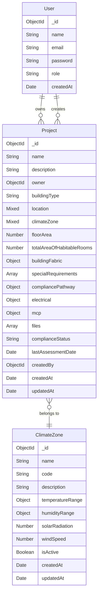

# NCC Section J Compliance Checker - Database Structure

## Entity Relationship Diagram (UML)



## Entity Descriptions

### User
- Primary entity for user management
- Stores user authentication and authorization information
- Has a one-to-many relationship with Projects (as owner and creator)

### Project
- Core entity for building compliance assessment
- Contains building specifications and compliance information
- References User (owner and creator) and ClimateZone
- Stores embedded schemas for:
  - Building fabric details
  - Special requirements
  - Compliance pathway
  - Electrical systems
  - MCP (Model Context Protocol)
  - Files
- Tracks compliance status and assessment history

### ClimateZone
- Defines climate zones and their characteristics
- Stores temperature, humidity, and environmental data
- Used for determining building compliance requirements

## Relationships

1. User to Project:
   - One-to-many relationship
   - A user can own multiple projects
   - A user can create multiple projects

2. Project to ClimateZone:
   - Many-to-one relationship
   - Projects must belong to a specific climate zone
   - Climate zones can have multiple projects

## Indexes

1. User:
   - email (unique)

2. Project:
   - owner
   - createdBy

3. ClimateZone:
   - code
   - name (unique)

## Notes

- All entities include timestamps for creation and updates
- Password fields are hashed before storage
- Compliance status is tracked at both project and requirement levels
- Embedded schemas are used for complex nested data structures
- Location and climateZone fields support both string and object values

## Embedded Schema Structures

### Project BuildingFabric
```javascript
buildingFabric: {
    walls: {
        external: {
            rValueByZone: {
                Zones_1_3: String,
                Zones_4_6: String,
                Zones_7_8: String
            },
            thermalBreaks: {
                metalFramed: Boolean
            }
        }
    },
    roof: {
        rValueByZone: {
            Zones_1_5: String,
            Zone_6: String,
            Zones_7_8: String
        },
        solarAbsorptance: {
            max: Number,
            exemptZones: [String]
        }
    },
    floor: {
        rValueByZone: {
            Zones_1_3: String,
            Zones_4_6: String,
            Zones_7_8: String
        }
    },
    glazing: {
        external: {
            shgcByZone: {
                Zones_1_3: Number,
                Zones_4_6: Number,
                Zones_7_8: Number
            },
            uValueByZone: {
                Zones_1_3: Number,
                Zones_4_6: Number,
                Zones_7_8: Number
            }
        }
    }
}
```

### Project SpecialRequirements
```javascript
specialRequirements: [{
    trigger: String,
    requirements: Map,
    conditions: [String],
    exemptions: Map,
    complianceStatus: String
}]
```

### Project CompliancePathway
```javascript
compliancePathway: {
    applicability: String,
    verification: String,
    requirements: Map,
    complianceStatus: String
}
```

### Project Electrical
```javascript
electrical: {
    loads: [{
        type: String,
        name: String,
        partNumber: String,
        description: String,
        manufacturer: String,
        specifications: Map,
        status: String
    }],
    energyMonitoring: [{
        systemType: String,
        name: String,
        partNumber: String,
        description: String,
        manufacturer: String,
        specifications: Map,
        status: String,
        connectedLoads: [ObjectId]
    }],
    complianceStatus: String,
    lastAssessmentDate: Date
}
```

### Project MCP (Model Context Protocol)
```javascript
mcp: {
    currentStep: {
        type: String,
        enum: ['FILE_UPLOAD', 'TEXT_EXTRACTION', 'INITIAL_ANALYSIS', 'PROJECT_UPDATE', 'NEXT_ANALYSIS'],
        default: 'FILE_UPLOAD'
    },
    lastUpdated: Date,
    history: [{
        step: String,
        timestamp: Date,
        status: {
            type: String,
            enum: ['PENDING', 'COMPLETED', 'FAILED']
        },
        error: String
    }],
    analysisResults: {
        hasAirConditioning: Boolean,
        lastAnalyzed: Date,
        rawAnalysis: Object
    },
    processingStatus: {
        type: String,
        enum: ['IDLE', 'PROCESSING', 'COMPLETED', 'FAILED'],
        default: 'IDLE'
    }
}
```

### Project Files
```javascript
files: [{
    filename: String,
    originalName: String,
    path: String,
    size: Number,
    mimetype: String,
    uploadedAt: Date
}]
```

## Schema Usage Notes

1. **Embedded Schemas**
   - All complex nested data structures are implemented as embedded schemas
   - Embedded schemas don't require their own collections
   - Each embedded schema has both standalone and embedded versions
   - Standalone versions include required fields and indexes
   - Embedded versions omit required fields for flexibility

2. **Mixed Type Fields**
   - Location and climateZone fields support both string and object values
   - Allows for backward compatibility with existing data
   - Provides flexibility in how data is stored and queried

3. **Performance Considerations**
   - Embedded schemas reduce the need for joins
   - Consider document size limits when using embedded schemas
   - Use projection to limit returned fields
   - Index frequently queried fields 