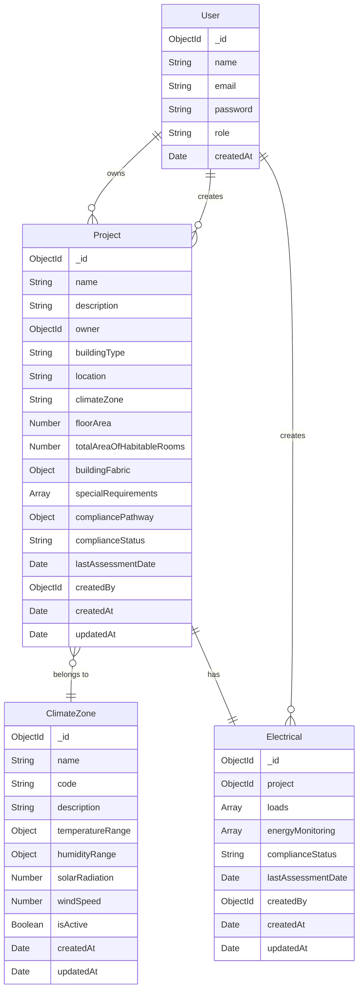

# NCC Section J Compliance Checker - Database Structure

## Entity Relationship Diagram (UML)



## Entity Descriptions

### User
- Primary entity for user management
- Stores user authentication and authorization information
- Has a one-to-many relationship with Projects (as owner and creator)

### Project
- Core entity for building compliance assessment
- Contains building specifications and compliance information
- References User (owner and creator) and ClimateZone
- Stores building fabric details and special requirements
- Tracks compliance status and assessment history
- Has exactly one Electrical section

### ClimateZone
- Defines climate zones and their characteristics
- Stores temperature, humidity, and environmental data
- Used for determining building compliance requirements

### Electrical
- Manages electrical systems and energy monitoring
- Contains arrays of loads and energy monitoring systems
- Tracks compliance status for electrical systems
- References Project and User (creator)
- Belongs to exactly one Project

## Relationships

1. User to Project:
   - One-to-many relationship
   - A user can own multiple projects
   - A user can create multiple projects

2. Project to ClimateZone:
   - Many-to-one relationship
   - Projects must belong to a specific climate zone
   - Climate zones can have multiple projects

3. Project to Electrical:
   - One-to-one relationship
   - Each project has exactly one electrical section
   - Each electrical section belongs to exactly one project

4. User to Electrical:
   - One-to-many relationship
   - A user can create multiple electrical systems
   - Electrical systems must have a creator

## Indexes

1. User:
   - email (unique)

2. Project:
   - owner
   - createdBy

3. ClimateZone:
   - code
   - name (unique)

4. Electrical:
   - project
   - loads.partNumber
   - energyMonitoring.partNumber

## Notes

- All entities include timestamps for creation and updates
- Password fields are hashed before storage
- Compliance status is tracked at both project and requirement levels
- Building fabric details are stored as nested objects
- Special requirements are stored as an array of objects 

## Map Data Structures

### Project BuildingFabric Object
```javascript
buildingFabric: {
    walls: {
        material: String,
        thickness: Number,
        rValue: Number
    },
    roof: {
        material: String,
        thickness: Number,
        rValue: Number
    },
    floor: {
        material: String,
        thickness: Number,
        rValue: Number
    },
    windows: {
        material: String,
        thickness: Number,
        uValue: Number
    }
}
```

### Project SpecialRequirements Array
```javascript
specialRequirements: [{
    type: String,  // enum: ['fire', 'accessibility', 'acoustic', 'energy', 'other']
    description: String,
    status: String  // enum: ['pending', 'compliant', 'non_compliant']
}]
```

## Map Usage Notes

1. **Project BuildingFabric Object**
   - Structured object (not a Map) containing building envelope details
   - Includes thermal properties for all major building elements
   - Used for compliance calculations and energy performance assessment

2. **Project SpecialRequirements Array**
   - Array of requirement objects with type and status
   - Tracks compliance status for each special requirement
   - Supports multiple requirement types (fire, accessibility, etc.)

## Map Performance Considerations

1. **Indexing**
   - Map keys are automatically indexed in MongoDB
   - Consider compound indexes for frequently queried map fields
   - Use sparse indexes for optional map fields

2. **Querying**
   - Use dot notation to query nested map fields
   - Consider using aggregation pipeline for complex map queries
   - Use projection to limit returned map fields

3. **Updates**
   - Use $set for updating specific map fields
   - Use $unset to remove map fields
   - Consider atomic operations for concurrent updates 