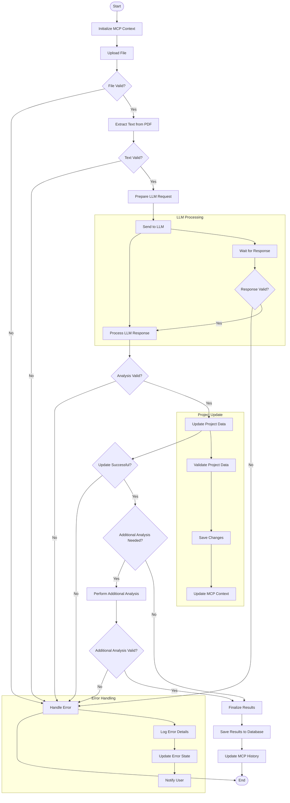

# MCP File Processing Activity Diagram

## Overview
This activity diagram illustrates the detailed flow of activities in the MCP (Model Context Protocol) file processing system, showing the sequence of actions, decision points, and parallel activities that occur during file processing and analysis.

## Activity Diagram

## Activity Descriptions

### Initialization
1. **Initialize MCP Context**
   - Create new MCPContext instance
   - Set initial state
   - Initialize history tracking

### File Processing
1. **Upload File**
   - Receive file from client
   - Store in temporary location
   - Generate unique identifier

2. **Validate File**
   - Check file existence
   - Verify file type
   - Validate file size
   - Check file integrity

3. **Extract Text**
   - Read PDF content
   - Extract text using PDF parser
   - Clean and format text

### LLM Processing
1. **Prepare LLM Request**
   - Format text for LLM
   - Add context information
   - Set analysis parameters

2. **Send to LLM**
   - Establish connection
   - Send request
   - Monitor response

3. **Process Response**
   - Parse LLM output
   - Extract relevant information
   - Format results

### Project Update
1. **Update Project Data**
   - Validate analysis results
   - Update project fields
   - Prepare database changes

2. **Save Changes**
   - Execute database updates
   - Verify changes
   - Handle conflicts

### Finalization
1. **Finalize Results**
   - Compile all analysis results
   - Format final output
   - Prepare summary

2. **Save Results**
   - Store in database
   - Update project status
   - Generate reports

### Error Handling
1. **Handle Error**
   - Log error details
   - Update error state
   - Notify user
   - Clean up resources

## Decision Points

1. **File Valid?**
   - Checks file properties
   - Validates format and size
   - Verifies integrity

2. **Text Valid?**
   - Validates extracted text
   - Checks content quality
   - Verifies completeness

3. **Analysis Valid?**
   - Validates LLM response
   - Checks result format
   - Verifies completeness

4. **Update Successful?**
   - Verifies database changes
   - Checks data consistency
   - Validates updates

5. **Additional Analysis Needed?**
   - Evaluates current results
   - Determines if more analysis required
   - Checks analysis depth

## Parallel Activities

1. **Error Handling**
   - Logging
   - State updates
   - User notification

2. **LLM Processing**
   - Request handling
   - Response monitoring
   - Result processing

3. **Project Update**
   - Data validation
   - Change application
   - Context updates

## Notes

- Activities are tracked in MCPHistory
- Each activity updates MCPContext
- Error handling is consistent throughout
- Parallel activities are synchronized
- Clear entry and exit points
- Activity timing is logged
- Resource cleanup at each step 