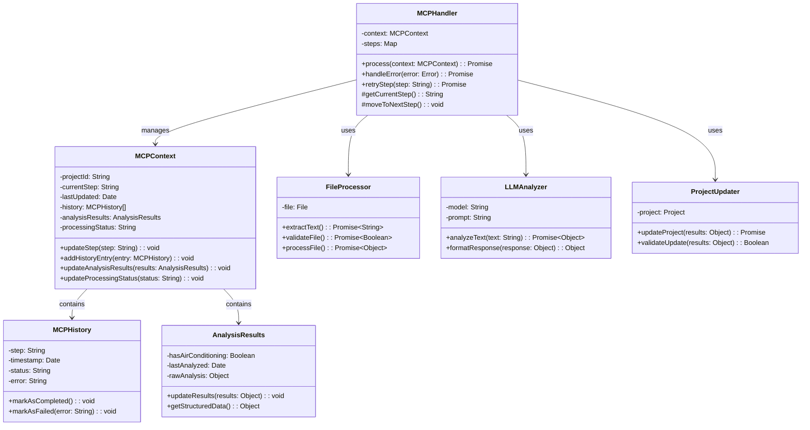

# MCP (Model Context Protocol) Class Diagram

## Overview
The MCP system is designed to handle complex AI/LLM interactions for document analysis and project updates. It follows a protocol-based approach where each step in the process is clearly defined and tracked.

## Class Diagram

## Class Descriptions

### MCPHandler
- Main controller class for the MCP system
- Manages the flow of the protocol
- Handles errors and retries
- Coordinates between different components

### MCPContext
- Maintains the state of the MCP process
- Tracks current step and history
- Stores analysis results
- Manages processing status

### MCPHistory
- Records each step in the process
- Tracks success/failure status
- Stores error information
- Maintains timestamps

### AnalysisResults
- Stores structured analysis data
- Manages raw LLM responses
- Provides formatted results
- Tracks analysis timestamps

### FileProcessor
- Handles file operations
- Extracts text from documents
- Validates file formats
- Processes file content

### LLMAnalyzer
- Manages LLM interactions
- Formats prompts
- Processes responses
- Structures analysis results

### ProjectUpdater
- Updates project data
- Validates updates
- Manages data consistency
- Handles update errors

## Protocol Steps

1. **FILE_UPLOAD**
   - File validation
   - Initial processing
   - Context initialization

2. **TEXT_EXTRACTION**
   - Document parsing
   - Text extraction
   - Content validation

3. **INITIAL_ANALYSIS**
   - LLM processing
   - Feature extraction
   - Result structuring

4. **PROJECT_UPDATE**
   - Data validation
   - Project modification
   - Status update

5. **NEXT_ANALYSIS**
   - Additional processing
   - Result integration
   - Final updates

## Error Handling

- Each step includes error handling
- Retry mechanisms for transient failures
- Error logging and tracking
- State recovery capabilities

## State Management

- Context preservation between steps
- History tracking
- Status monitoring
- Result persistence

## Notes

- All classes follow single responsibility principle
- Error handling is implemented at each level
- State management is centralized in MCPContext
- Protocol steps are clearly defined and tracked
- Each component is independently testable 