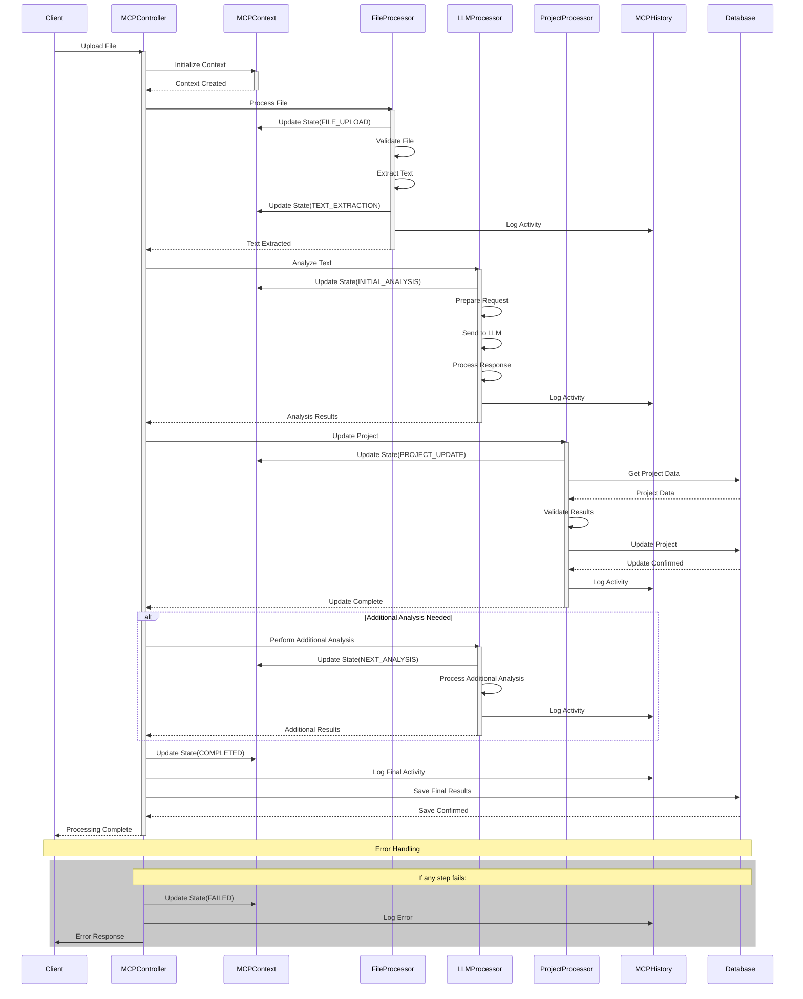

# MCP Component Interaction Sequence Diagram

## Overview
This sequence diagram illustrates the interactions between different components of the MCP (Model Context Protocol) system during file processing, showing the flow of messages and data between components.

## Sequence Diagram

## Component Descriptions

### Client
- Initiates file upload
- Receives processing results
- Handles error responses

### MCPController
- Coordinates the entire process
- Manages component interactions
- Handles error conditions
- Updates overall state

### MCPContext
- Maintains processing state
- Stores current context
- Tracks progress
- Manages state transitions

### FileProcessor
- Handles file validation
- Extracts text from PDF
- Manages file operations
- Updates file processing state

### LLMProcessor
- Prepares LLM requests
- Communicates with LLM
- Processes LLM responses
- Manages analysis state

### ProjectProcessor
- Updates project data
- Validates results
- Manages database operations
- Tracks project state

### MCPHistory
- Logs all activities
- Records state changes
- Maintains processing history
- Tracks error conditions

### Database
- Stores project data
- Manages data updates
- Handles data persistence
- Provides data retrieval

## Message Flow

1. **Initialization**
   - Client uploads file
   - MCPController initializes context
   - System prepares for processing

2. **File Processing**
   - FileProcessor validates file
   - Text extraction occurs
   - State updates to TEXT_EXTRACTION

3. **LLM Analysis**
   - LLMProcessor prepares request
   - Analysis is performed
   - Results are processed
   - State updates to INITIAL_ANALYSIS

4. **Project Update**
   - ProjectProcessor validates results
   - Database is updated
   - State updates to PROJECT_UPDATE

5. **Additional Analysis**
   - Optional additional processing
   - State updates to NEXT_ANALYSIS
   - Results are integrated

6. **Completion**
   - Final state update
   - Results are saved
   - Client is notified

## Error Handling

- Each component can trigger error handling
- Errors are logged in MCPHistory
- State updates to FAILED
- Client receives error notification
- System can be reset

## Notes

- All state changes are logged
- Components maintain their own state
- Clear separation of concerns
- Synchronous communication
- Error handling at each step
- History tracking throughout
- Database consistency maintained 