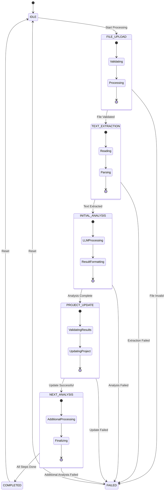

# MCP File Processing State Machine

## Overview
This state machine diagram illustrates the flow of states and transitions in the MCP (Model Context Protocol) file processing system. It shows how the system moves through different states during file processing, analysis, and project updates.

## State Machine Diagram

## State Descriptions

### Main States
1. **IDLE**
   - Initial state
   - System is ready to start processing
   - Can be reached after completion or failure

2. **FILE_UPLOAD**
   - Validates file existence and format
   - Checks file size and type
   - Initializes processing context

3. **TEXT_EXTRACTION**
   - Reads file content
   - Extracts text from PDF
   - Validates extracted content

4. **INITIAL_ANALYSIS**
   - Sends text to LLM
   - Processes LLM response
   - Formats analysis results

5. **PROJECT_UPDATE**
   - Validates analysis results
   - Updates project data
   - Saves changes to database

6. **NEXT_ANALYSIS**
   - Performs additional analysis if needed
   - Integrates results
   - Finalizes processing

7. **COMPLETED**
   - All steps successfully completed
   - Results saved
   - System ready for next task

8. **FAILED**
   - Error occurred during processing
   - Error details recorded
   - System can be reset

### Sub-States

#### FILE_UPLOAD
- **Validating**: Checking file properties
- **Processing**: Initial file processing
- **Complete**: Ready for next step

#### TEXT_EXTRACTION
- **Reading**: Reading file content
- **Parsing**: Extracting text
- **Complete**: Text ready for analysis

#### INITIAL_ANALYSIS
- **LLMProcessing**: Sending to LLM
- **ResultFormatting**: Processing response
- **Complete**: Analysis ready

#### PROJECT_UPDATE
- **ValidatingResults**: Checking analysis
- **UpdatingProject**: Saving changes
- **Complete**: Project updated

#### NEXT_ANALYSIS
- **AdditionalProcessing**: Extra analysis
- **Finalizing**: Completing process
- **Complete**: All done

## Transitions

1. **Start Processing**
   - Trigger: New file upload
   - From: IDLE
   - To: FILE_UPLOAD

2. **File Validation**
   - Trigger: File checks complete
   - From: FILE_UPLOAD
   - To: TEXT_EXTRACTION or FAILED

3. **Text Extraction**
   - Trigger: Text extracted
   - From: TEXT_EXTRACTION
   - To: INITIAL_ANALYSIS or FAILED

4. **Analysis Complete**
   - Trigger: LLM processing done
   - From: INITIAL_ANALYSIS
   - To: PROJECT_UPDATE or FAILED

5. **Project Updated**
   - Trigger: Database update complete
   - From: PROJECT_UPDATE
   - To: NEXT_ANALYSIS or FAILED

6. **Processing Complete**
   - Trigger: All steps done
   - From: NEXT_ANALYSIS
   - To: COMPLETED or FAILED

7. **Reset**
   - Trigger: Manual reset or completion
   - From: FAILED or COMPLETED
   - To: IDLE

## Error Handling

- Each state includes error detection
- Errors transition to FAILED state
- Error details stored in context
- System can be reset from FAILED state

## Notes

- States are tracked in MCPContext
- History maintained in MCPHistory
- Each transition updates context
- Error handling at each step
- State machine is deterministic
- Clear entry and exit points 